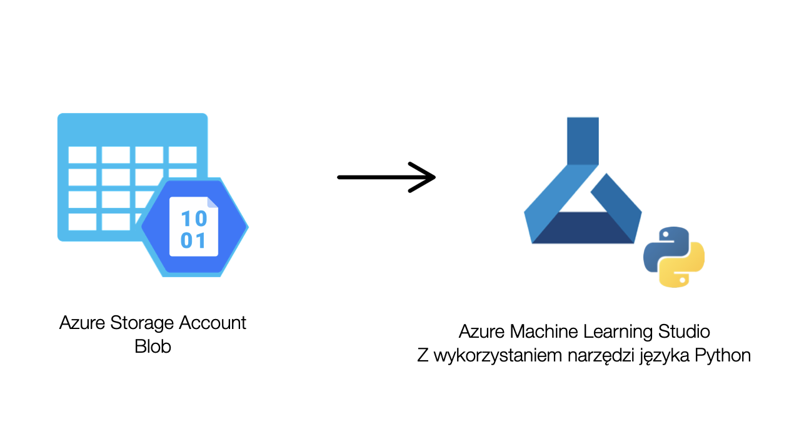
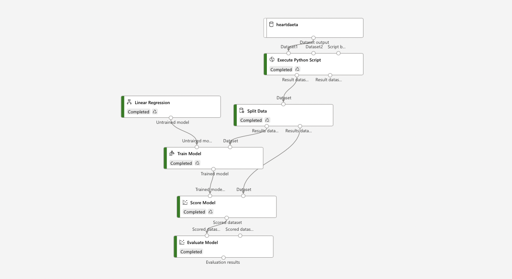
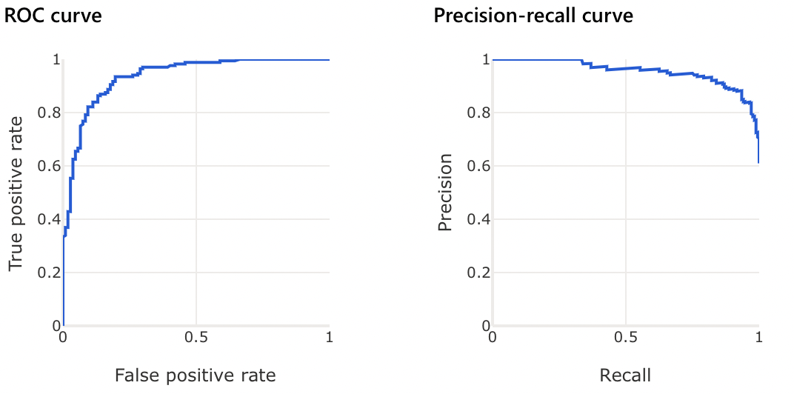
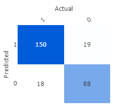
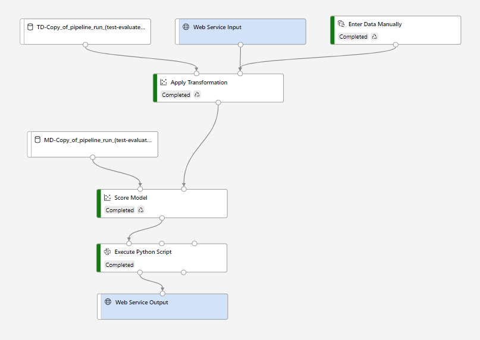

# WUT_Azure_proj1
Project 1 for Microsoft Azure on WUT

## Table of contents
* [Team](#the-team)
* [Tematyka projektu](#tematyka-projektu)
* [Architektura](#architektura)
* [Rozwiązanie](#rozwiązanie)
* [Demo dzałania](#demo-działania)

## The Team
* Hubert Kunikowski
* Danuta Stawiarz

## Tematyka projektu
Cel projektu stanowiło utworzenie modelu, który na podstawie wprowadzonych danych o stanie zdrowia pacjenta wykonuje predykcję prawdopodobieństwa, z jakim może on zapaść na chorobę serca. Projekt zakładał wykorzystanie i przetestowania działania komponentów platformy Azure - Azure Storage Account oraz Machine Learning Studio oraz udostępnienie programu potencjalnemu klientowi.

### Opis danych
W skład danych dotyczących parametrów zdrowotnych pacjenta wchodzą:
* Sex - płeć pacjenta (F- kobieta, M- mężczyzna),
* Age - wiek pacjenta,
* ChestPainType - typ występującego bólu ( TA: Typical Angina, ATA: Atypical Angina, NAP: Non-Anginal Pain, ASY: Asymptomatic),
* RestingBP - ciśnienie krwi (mm Hg),
* Cholersterol (mm/dl),
* FastingBS - cukier we krwi (1 jeśli FastingBS > 120 mg/dl, 0: w innym wypadku),
* RestingEC - pomiary elektrodiagramu (Normal: Normal, ST: having ST-T wave abnormality (T wave inversions and/or ST elevation or depression of > 0.05 mV),
* MaxiumumHR - najwyższe zaobserwowane tętno, 
* ExerciseAngina - dławica piersiowa wywołana wysiłkiem (True, False)
* Oldpeak,
* ST_Slope - nachylenie (Up: upsloping, Flat: flat, Down: downsloping),
* HeartDisease - choroba serca (1 jeśli obecna, 0 jeśli brak)

## Architektura
W projekcie zostały wykorzystane następujące komponenty platformy Azure:
* Azure Storage Account - Blob - w tym serwisie przechowywane są pliki zawierające dane pacjentów
* Machine Learning Studio - w tym serwisie następuje przetworzenie danych oraz tworzenie modelu wykonującego predykcję

Schemat działania przedstawiony został w formie graficznej poniżej:

## Rozwiązanie
Rozwiązanie zakłada działania na etapie przechowywania danych, ich przetwarzania, tworzenia modelu predykcji oraz deployowania go w celu komercyjnego zastosowania.

### Przechowywanie danych
W celu trwałego przechowywania danych utworzony został serwis Storage Account. Plik o formacie CSV zawierający informacje dotyczące parametrów zdrowia pacjentów został umieszczony w kontenerze o nazwie "heartdata".

### Przetwarzanie danych
Kolejny krok stanowiło utworzenie serwisu Machine Learning Studio. Na początku należało zaimportować dane przechowywane w Azure Storage. W stym celu utworzono nowy Datastore, a w jego obrębie Dataset, w którym dane z pliku CSV zostały umieszczone w formie tabelarycznej.
Następnie został stworzonony nowe Pipeline, gdzie dane uległy przetworzeniu. Koniecznymi operacjami były:
* zamiana danych kategorycznych na liczbowe (Sex, Exercise Angina)
* przeskalowanie danych kategorycznych (ChestPainType, RestingECG, ST_Slope)
* usunięcie braków

Do dokonania zmian w danych wykorzystano skrypty napisane w języku Python wykonywane w obrębie pipelinu. Umożliwiają one sprawne i nieskomplikowane przetwarzanie danych w tabelach w wybrany sposób. Skrypty zostały umieszczone w folderze scripts.

### Trenowanie modelu i ewaluacja
Model umożliwiający predykcję wystąpienia u pacjenta choroby serca korzysta z regresji. Pipeline zawierający zarówno przetwarzanie danych, ich podział na zbiór uczący oraz testowy i trening modelu przedstawia się następująco:

Skuteczność predykcji przewidywanego modelu możliwa jest do sprawdzenia za pomocą opcji "Evaluate Model". Widać, że opracowany na podstawie danych "heartdata" model uzyskał bardzo dobre wyniki:
 * Accuracy 0.865
 * Precision 0.888
 * Recall 0.893
 * F1 Score 0.89
 * AUC 0.936

Dobrą jakość predykcji potwierdza również wykres krzywej ROC:

Skuteczność przewidywania dobrze obrazuje następujący diagram:

### Interference model
W celu wykorzystania utworzonego modelu predykcji konieczne jest utworzenie "Interference pipeline", który z wykorzystaniem modelu będzie w stanie przeprowadzać predykcję dla danych docelowo wprowadzanych przez użytkownika. Wymaga to dokonania nielicznych zmian w przebiegu- zmiany źródła danych na "Enter Data Manually".

Utworzony pipeline prezentuje się następująco:

### Deploy i test działania
Ostatni krok stanowi deploy utworzonego "Interference pipeline". Po wykonaniu tej czynności link do endpointu pojawia się w zakładce "Endpoints", dzięki czemu klient może z łatwością wykorzystać go w swojej aplikaji. Działanie zostało przedstawione w filmiku na końcu pliku.

## Demo działania
Pod linkiem umieszczono film, na którym zostało przedstawione działanie projektu. Działanie projektu zaprezentowane zostało poprzez uruchomienie napisanego w języku Python konsolowego programu, wykorzystującego utworzony przy pomocy platformy Microsoft Azure endpoint.
Link: https://youtu.be/qEi_2D5EfEY
